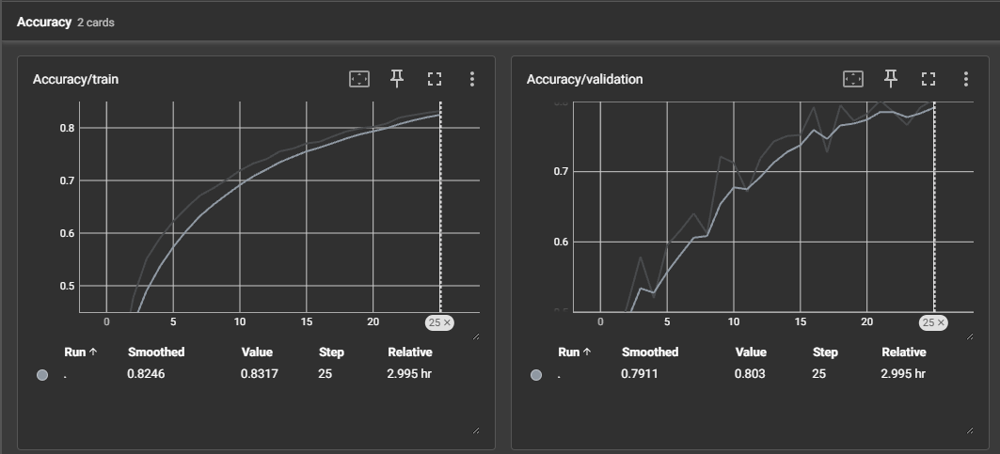
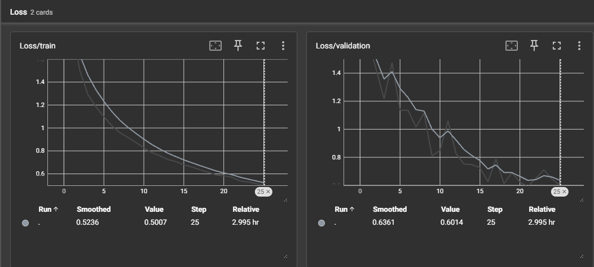
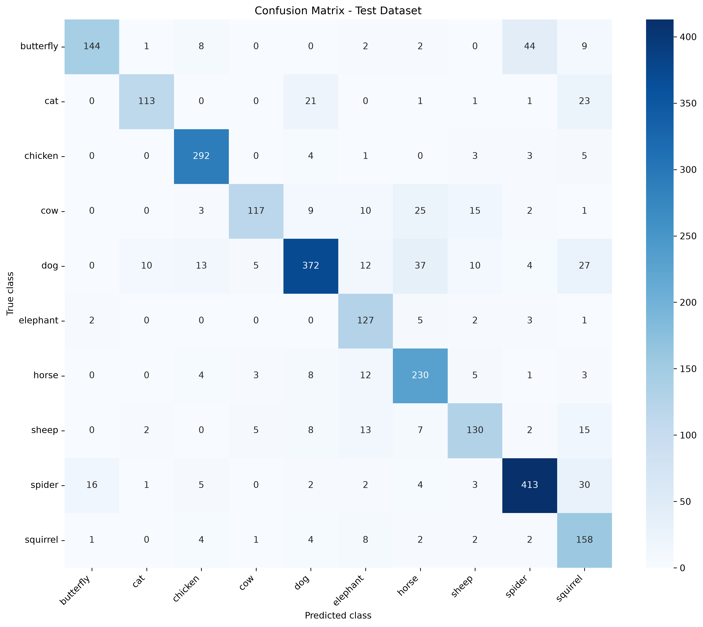
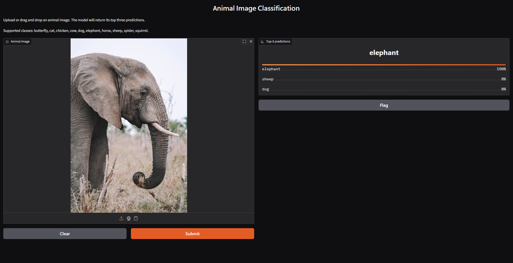

# Animals Image Classification — CNN from Scratch

A complete PyTorch image classification project that classifies animal images into 10 categories using a custom Convolutional Neural Network (CNN).

The CNN is implemented and trained from scratch without transfer learning. The project covers dataset preparation, training, validation, test evaluation, checkpointing, TensorBoard monitoring, single-image inference, and an interactive Gradio application.

## Supported Classes

- Butterfly
- Cat
- Chicken
- Cow
- Dog
- Elephant
- Horse
- Sheep
- Spider
- Squirrel

## Features

- Custom PyTorch `Dataset` implementation
- Separate data augmentation and evaluation transforms
- Stratified training/validation split
- CNN built from scratch
- SGD optimizer with momentum and weight decay
- Training and validation monitoring with TensorBoard
- Best and latest model checkpointing
- Resume training from a checkpoint
- Test-set evaluation with classification metrics
- Confusion matrix visualization
- Top-k prediction for individual images
- Interactive Gradio web interface

## Model Architecture

The custom CNN contains five convolutional blocks. Each block uses convolution, batch normalization, ReLU activation, and max pooling.

The extracted features are passed through adaptive average pooling and a fully connected classifier.

```text
Input image: 3 × 224 × 224

Conv block 1:  3 → 8 channels
Conv block 2:  8 → 16 channels
Conv block 3: 16 → 32 channels
Conv block 4: 32 → 64 channels
Conv block 5: 64 → 64 channels

Adaptive average pooling: 64 × 4 × 4
Flattened features: 1024
Fully connected layer: 1024 → 256
Dropout: 0.5
Output layer: 256 → 10 classes
```

Total trainable parameters: **413,170**

## Project Structure

```text
animals-image-classification/
├── app.py
├── requirements.txt
├── README.md
├── .gitignore
├── src/
│   ├── __init__.py
│   ├── dataset.py
│   ├── model.py
│   ├── train.py
│   ├── evaluate.py
│   └── inference.py
└── outputs/
    ├── evaluation/
    │   ├── classification_report.txt
    │   ├── evaluation_metrics.json
    │   └── confusion_matrix.png
    └── figures/
        ├── accuracy_curves.png
        ├── loss_curves.png
        └── app_demo.png
```

## Dataset

The dataset is organized into one folder for each animal class:

```text
image_data/
├── train/
│   ├── butterfly/
│   ├── cat/
│   ├── chicken/
│   ├── cow/
│   ├── dog/
│   ├── elephant/
│   ├── horse/
│   ├── sheep/
│   ├── spider/
│   └── squirrel/
└── test/
    ├── butterfly/
    ├── cat/
    ├── chicken/
    ├── cow/
    ├── dog/
    ├── elephant/
    ├── horse/
    ├── sheep/
    ├── spider/
    └── squirrel/
```

The training directory contains **23,699 images**. It is divided using a stratified split:

- Training samples: **18,959**
- Validation samples: **4,740**
- Validation ratio: **20%**
- Independent test samples: **2,596**

The dataset is stored locally in `image_data/` and is not included in this repository.

## Installation

Clone the repository:

```bash
git clone <YOUR-REPOSITORY-URL>
cd animals-image-classification
```

Create a virtual environment:

```bash
python -m venv .venv
```

Activate it on Windows:

```bash
.venv\Scripts\activate
```

Activate it on Linux or macOS:

```bash
source .venv/bin/activate
```

Install the required packages:

```bash
pip install -r requirements.txt
```

## Training

Start training with the default configuration:

```bash
python -m src.train
```

Default training configuration:

| Parameter | Value |
|---|---:|
| Epochs | 25 |
| Batch size | 64 |
| Image size | 224 × 224 |
| Validation ratio | 0.2 |
| Learning rate | 0.01 |
| Momentum | 0.9 |
| Weight decay | 0.0001 |
| Random seed | 42 |

Custom parameters can be passed through the command line:

```bash
python -m src.train --epochs 30 --batch-size 32 --learning-rate 0.005
```

During training, the following checkpoints are created locally:

```text
outputs/checkpoints/last.pt
outputs/checkpoints/best.pt
```

Resume training from a checkpoint:

```bash
python -m src.train --resume outputs/checkpoints/last.pt
```

The checkpoint files are not included in the repository because they are generated during training.

## TensorBoard

Start TensorBoard with:

```bash
tensorboard --logdir outputs/tensorboard
```

Then open the displayed local URL, usually:

```text
http://localhost:6006
```

### Accuracy Curves



### Loss Curves



## Test Evaluation

Evaluate the best checkpoint on the independent test dataset:

```bash
python -m src.evaluate
```

### Test Results

| Metric | Result |
|---|---:|
| Best validation accuracy | 80.30% |
| Test loss | 0.5946 |
| Test accuracy | 80.74% |
| Macro precision | 0.8048 |
| Macro recall | 0.7964 |
| Macro F1-score | 0.7907 |
| Weighted precision | 0.8236 |
| Weighted recall | 0.8074 |
| Weighted F1-score | 0.8081 |

The complete classification report is available in:

```text
outputs/evaluation/classification_report.txt
```

The machine-readable metrics are available in:

```text
outputs/evaluation/evaluation_metrics.json
```

### Confusion Matrix



## Interactive Application

After training the model, launch the Gradio application:

```bash
python app.py
```

Upload an image through the interface to obtain the top predicted animal classes and their probabilities.



The application requires the trained checkpoint:

```text
outputs/checkpoints/best.pt
```

## Main Technologies

- Python
- PyTorch
- Torchvision
- scikit-learn
- NumPy
- Pillow
- Matplotlib
- Seaborn
- TensorBoard
- Gradio
- tqdm

## Notes

- The model was trained from scratch without pretrained weights.
- Training and validation data are generated from the same training directory using a stratified split.
- The independent test dataset is used only for final evaluation.
- Dataset files, checkpoints, virtual environments, and TensorBoard event files are excluded from Git.